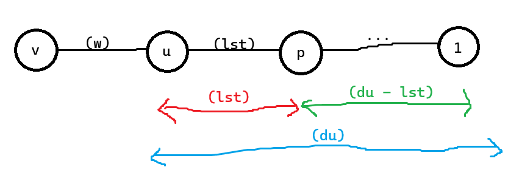

# Cạnh Đôi

Link bài: https://marisaoj.com/problem/177

## Ý tưởng

Ta sẽ đặt:
- $d[u][0]$: độ dài đường đi ngắn nhất từ $1$ tới $u$ mà đi qua chẵn cạnh _(tức là đi qua toàn cạnh đôi)_;
- $d[u][1]$: độ dài đường đi ngắn nhất từ $1$ tới $u$ mà đi qua lẻ cạnh _(tức là đi qua toàn cạnh đôi và kết thúc bằng 1 cạnh đơn)_.

Bây giờ thì chỉ việc dijkstra như bình thường thôi, những gì bạn cần lưu trong 
`priority_queue` của mình là ${ lst, du, u }$ lần lượt nghĩa là:
- $lst$: Trọng số cạnh cuối cùng trước đỉnh $u$ _(trọng số này bằng $0$ nếu trước đó đi tới đỉnh $u$ qua chẵn cạnh)_;
- $du$: Độ dài đường đi ngắn nhất tới đỉnh $u$ qua chẵn (hoặc lẻ) cạnh tùy thuộc vào $lst = 0$ (hoặc $lst \neq 0$).
- $u$: Đỉnh $u$ đã duyệt đến.

Trong lúc duyệt cạnh đỉnh $v$ kề đỉnh $u$, để quyết định có thêm đỉnh $v$ vào `priority_queue` hay không 
ta cần xét điều kiện sau:

- Nếu $(lst = 0)$ tức là trước đó bạn đã đi tới $u$ qua chẵn cạnh:
  + Như vậy nếu giờ bạn đi tới cạnh $v$ thì sẽ đi qua ***lẻ***  cạnh, nên ta phải kiểm tra và cập nhật $d[v][1]$:
    - Nếu $(d[v][1] > du + w)$ thì ta sẽ cập nhật và thêm $v$ vào hàng đợi.
- Nếu $(lst \neq 0)$ tức là trước đi đã đi tới $u$ qua lẻ cạnh:
  + Vậy nếu giờ bạn đi tới cạnh $v$ thì sẽ là đi qua ***chẵn***  cạnh, nên ta phải kiểm tra và cập nhật $d[v][0]$:
    - Nếu $(d[v][0] > du - lst + lst * w)$ thì ta sẽ cập nhật và thêm $v$ vào hàng đợi.
      * *giải thích*: ta lấy $du - lst$ sẽ nhận được khoảng cách từ đỉnh $1$ tới đỉnh cha gần nhất của $u$ mà qua chẵn cạnh.
         

::: details Code tham khảo
```cpp
#include <bits/stdc++.h>
using namespace std;

const int inf = 1e9 + 7;
const int maxn = 2e5 + 1;

int n, m;
vector<pair<int, int> > a[maxn];
int d[maxn][2];

void dijkstra(int s) {
	priority_queue<tuple<int, int, int> > q; // weight of last edge, dist, u
	fill(&d[0][0], &d[maxn][0], +inf);
	d[s][0] = 0;
	q.push({ 0, 0, s });
	while (q.size()) {
		int lst, du, u;
		tie(lst, du, u) = q.top();
		du = -du;
		lst = -lst;
		q.pop();
		if (du != d[u][lst != 0]) continue;
		for (pair<int, int> &e : a[u]) {
			int v = e.first, w = e.second;
			if (lst == 0) {
				if (d[v][1] > du + w) {
					d[v][1] = du + w;
					q.push({ -w, -d[v][1], v });
				}
			} else {
				if (d[v][0] > du + lst * (w - 1)) {
					d[v][0] = du + lst * (w - 1);
					q.push({ 0, -d[v][0], v });
				}
			}
		}
	}
}

int main() {
  ios::sync_with_stdio(false);  cin.tie(nullptr);
  cin >> n >> m;
	for (int u, v, w, i = 0; i < m; ++i) {
		cin >> u >> v >> w;
		a[u].push_back({ v, w });
		a[v].push_back({ u, w });
	}
	dijkstra(1);
	if (d[n][0] >= +inf) {
		cout << -1;
	} else {
		cout << d[n][0];
	}
  return 0;
}
```
:::
